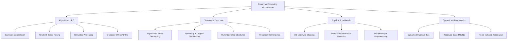

# Comprehensive Synthesis: Optimization Paradigms in Reservoir Computing (RC)

This document provides a structured analysis of the 25 research papers within this workspace, focusing on the optimization of Reservoir Computing (RC) networks. The analysis synthesizes what has been historically tried (prior art), the novel approaches proposed by the authors, their quantitative/qualitative effectiveness, and their highlighted limitations or future research directions.

---

## 1. Executive Summary & Overview of the Literature

Reservoir Computing (RC)—exemplified by Echo State Networks (ESNs) and Liquid State Machines (LSMs)—is a powerful recurrent neural network paradigm. Its defining characteristic is that the input-to-hidden and hidden-to-hidden (reservoir) weights are fixed and randomly initialized, and only the linear readout layer is trained. While this dramatically reduces training complexity, it shifts the engineering burden to **hyperparameter tuning** and **reservoir design**.

The papers in this collection address this bottleneck through four primary innovation areas:
1. **Algorithmic Hyperparameter Optimization (HPO)**: Moving from brute-force grid search to gradient-based, Bayesian, Simulated Annealing, or reinforcement-learning-inspired tuning.
2. **Network Topology & Structural Design**: Optimizing the internal connectivity matrix (symmetry, eigenvalues, modular clustering, or Recurrent Kernel limits) rather than relying on pure randomness.
3. **Physical & In-Materio Reservoir Engineering**: Leveraging nanoscale substrates (2D/3D nanowire networks, percolating memristors) and tailoring their timescales using time-delayed inputs.
4. **Dynamics & Framework Modifications**: Introducing structural constraints (dynamic bias, leaky integrators in Graph Neural Networks, or noise-induced resonance) to stabilize long-term chaotic predictions.

> [!NOTE]
> **Domain Outliers**:
> * **File 8 (`NAS-Bench-101`)** is a convolutional architecture search benchmark for computer vision, included as a general reference for neural architecture search.
> * **File 14 (`A Review of Reservoir Modeling...`)** focuses on geological/petroleum reservoir modeling and history matching using Graph Neural Networks and Particle Swarm Optimization. It is a distinct engineering domain and is flagged as an outlier below.

---

## 2. Prior Art: What Has Been Tried and Why It Fails

Historically, the construction and tuning of reservoir computing networks relied on empirical heuristics and random generation. The papers identify several critical shortcomings of these traditional practices:

* **Random Topology Generation**: Traditionally, reservoir connections are generated using simple Erdos-Renyi (ER) random graphs. This lacks a principled design, resulting in high variance in performance, poor reproducibility, and a lack of interpretability.
* **Manual Grid & Random Search**: Tuning ESN hyperparameters (such as spectral radius $\rho$, leaking rate $\alpha$, input scaling $\gamma$, and regularization $\beta$) has traditionally been performed using manual grid search. This is computationally expensive, scales poorly as the number of hyperparameters grows, and often misses optimal localized parameter pockets.
* **Long-Term Prediction Instability**: Autonomous prediction (where the model feeds its own output back as the next input) is highly sensitive to accumulated errors, causing trajectories to quickly diverge from the chaotic manifold of systems like the Lorenz or Kuramoto-Sivashinsky attractors.
* **Hardware Constraints**: For in-materio and optical reservoirs, physical properties (e.g., memristor variability, thermal drift) are not precisely known, rendering analytical gradient calculations impossible.

---

## 3. Core Paradigms of Innovation

### Paradigm A: Algorithmic Hyperparameter Optimization (HPO)
* **Gradient-Based Tuning (File 3)**: Calculates exact gradients of the validation loss with respect to hyperparameters (spectral radius, input scaling, leaking rate) to guide optimization.
* **Bayesian Optimization (Files 7, 17, 19)**: Uses Gaussian Processes and surrogate modeling (e.g., Spearmint, SurrogateOpt) to efficiently navigate high-dimensional hyperparameter spaces (up to 6 parameters simultaneously).
* **Simulated Annealing (File 6)**: Applies global stochastic search with $L1$ regularization to identify optimized networks, showing that the optimal spectral radius often violates traditional Echo State Property thresholds.
* **Adaptive Exploration (File 20)**: Implements an $\epsilon$-greedy search strategy to optimize the trade-offs of offline tuning time, combined with online transfer learning via Intrinsic Plasticity.

### Paradigm B: Topology and Structural Design
* **Linear RC Mode Decoupling (Files 2, 10, 11)**: Decouples a linear reservoir computer (LRC) into independent modes, reformulating the dynamics from the time domain to the frequency domain, and individually tuning each eigenvalue of the adjacency matrix.
* **Symmetry Analysis (File 1)**: Controls connectivity and weight symmetry independently, showing that symmetric topologies improve cross-prediction in convection models under partial observability.
* **Multi-Clustered Structures (File 18)**: Creates distinct sub-reservoirs (clusters) with sparse inter-cluster connections using a developmental time windows algorithm.
* **Recurrent Kernel Limits (File 5)**: Studies the asymptotic limits of sparse, leaky, and deep RC topologies, showing that optimal sparsity scales with reservoir size.

### Paradigm C: Physical & In-Materio Reservoir Engineering
* **Nanowire Stacking & Percolating Networks (Files 9, 15, 21)**: Explores 3D stacking of nanowires and self-assembled nanoparticle networks. Confirms that breaking symmetry via scale-free topologies or memristor heterogeneity dramatically improves performance.
* **Timescale Tailoring via Delayed Input (Files 16, 24)**: Feeds a time-delayed version of the input signal directly into the reservoir. This shifts the tuning complexity from internal hardware parameters to a simple 2D sweep of input delay parameters.

### Paradigm D: Modified Dynamics & Frameworks
* **Dynamic Structural Bias (File 13)**: Introduces a dynamic bias term using a similarity-weighted reference state library to constrain the reservoir trajectory to the target system's manifold.
* **Reservoir-Based Graph Convolution (File 12)**: Proposes RGC-Net, replacing conventional GCN trainable message-passing with fixed-random reservoir weights and a leaky integrator.
* **Noise-Induced Resonance (File 19)**: Injects an optimal amplitude of noise during training to maximize the Valid Prediction Time (VPT) of chaotic dynamics.

---

## 4. Detailed Paper-by-Paper Analysis

| File Index & Name | Core Approach / Optimization Methodology | Effectiveness / Performance Metrics | Limitations & Future Work |
| :--- | :--- | :--- | :--- |
| **File 1** `033117_1_5.0314081.md` *(Rathor et al., 2026)* | Analyzes symmetry in connectivity and weights across 5 topologies (random, symmetric, asymmetric, small-world) for physical fluid systems (L63, L8, Mackey-Glass, Shear Flow). | **Symmetric topologies (RS-S, WS-S)** show superior accuracy in cross-predicting unobserved variables in low-dimensional convection systems. | Topology benefits vanish in high-dimensional chaotic shear flows. Future work aims to test these on experimental fluid dynamics setups. |
| **File 2 & 10 & 11** `2509.23391v3.md` *(Tangerami et al., 2026)* | Decouples Linear RC (LRC) into independent modes; optimizes eigenvalues in the frequency domain (F-domain) for task-specific tuning. | Optimized LRC **outperforms random reservoirs** and matches/surpasses nonlinear reservoirs (tan, ReLU) of similar size on Lorenz system. | Limited to *linear* reservoir dynamics. Future work includes extending the mode-decoupling framework to weakly nonlinear nodes. |
| **File 3** `1-s2.0-S0893608019300413-main.md` *(Thiede & Parlitz, 2019)* | Derives exact gradients of the validation loss to tune input scaling, spectral radius, leak rate, and regularization. | **Improves RMSE by 33%** (Lorenz), **45%** (Mackey-Glass), and **10%** (Rössler) compared to grid search. | Requires differentiable activation functions and is susceptible to local minima. Future work suggests adaptive step-size adjustments. |
| **File 4** `1-s2.0-S092523122400033X-main.md` *(Mwamsojo et al., 2024)* | Stochastic gradient approximation using noisy validation loss measurements, tailored for physical hardware reservoirs. | Successfully tunes simulated optoelectronic and optical hardware ESNs under parameter drift and measurement noise. | Requires multiple system evaluations. Future work will investigate parallel evaluations in hardware arrays to speed up tuning. |
| **File 5** `1-s2.0-S0925231224014504-main.md` *(D'Inverno & Dong, 2025)* | Analytical comparison of leaky, sparse, and deep RC topologies in the infinite-size Recurrent Kernel (RK) limit. | Demonstrates that optimal sparsity level scales with reservoir size and that deep RC layer sizes should decrease sequentially. | The infinite-size RK limit assumes $N \to \infty$, which may not fully capture finite-size fluctuations in physical hardware. |
| **File 6** `10.3934_era.2022139.md` *(Ren & Ma, 2022)* | Global HPO using Simulated Annealing (SA) with L1 regularization to optimize weight distributions and spectral radius. | Discovers that optimized networks are asymmetric, and the optimal spectral radius **frequently exceeds 1** while maintaining stability. | High computational cost (requires 50 runs). Future work includes developing localized, faster search heuristics. |
| **File 7** `1611.05193v3.md` *(Yperman & Becker, 2016)* | Bayesian Optimization using Gaussian Processes to simultaneously tune up to 6 hyperparameters. | Matches or surpasses literature results on **Santa Fe laser** and **NARMA-10** in significantly fewer iterations than grid search. | Search bounds must be manually set. Future work suggests automated adaptive boundary adjustments during the GP search. |
| **File 8** `1902.09635v2.md` *(Ying et al., 2019)* | **[Outlier]** Public dataset and benchmark for CNN Neural Architecture Search (NAS) containing 423k unique architectures on CIFAR-10. | Standardizes NAS comparisons under equal compute budgets, demonstrating the strength of Bayesian and evolutionary baselines. | Evaluates CNN cell topologies for image classification, which does not map directly to recurrent/temporal RC dynamics. |
| **File 9 & 21** `2207.03070v1.md` / `d2nr07275k.md` *(Daniels et al., 2022; Mallinson et al., 2023)* | Models physical, self-assembled memristive nanoparticle/nanowire networks (PNNs) using 3D stacked topologies and realistic electrodes. | Shows that symmetry in regular arrays limits richness, whereas **scale-free topologies or memristor heterogeneity** break symmetry to maximize capacity. | Nanoscale assembly of scale-free networks is difficult to control. Future work involves developing top-down electrode lithography. |
| **File 12** `2603.24131v1.md` *(Soussi et al., 2026)* | Integrates fixed-random reservoir weights and a leaky integrator into GCN message-passing (RGC-Net) for graph classification. | **Mitigates over-smoothing** in deep GNNs, providing faster convergence and superior accuracy in predicting brain graph evolution. | RGC-Net is not permutation-invariant, which can affect performance on certain graphs. Future work will design invariant readout kernels. |
| **File 13** `5nbr-bqxb.md` *(Liu et al., 2026)* | Introduces a Dynamic Structural Bias (DB-RC) from a historical reference state library to constrain the autonomous prediction trajectory. | Significantly **stabilizes long-term chaotic predictions** and reduces ESN sensitivity to hyperparameters. | Library search scales poorly for high-dimensional systems. Future work proposes integrating autoencoders for latent-space searches. |
| **File 14** `A_Review_of_Reservoir_Modeling...` *(Hu et al., 2025)* | **[Outlier]** Reviews GNNs and GNT (Graph Network Transformers) combined with DEPSO for oil/gas reservoir history matching. | Accelerates history matching and connectivity identification in heterogeneous geological reservoirs compared to grid simulations. | Focuses on petroleum reservoir modeling (Darcy flow). Future work focuses on PINN integration to ensure physical pressure constraints. |
| **File 15** `Fang_2023_Mater._Futures_2_022701.md` *(Fang et al., 2023)* | Topical review of in-materio RC using nanowire memristive networks, synthesis methods, junction physics, and applications. | Highlights high energy efficiency and high spatial density of physical nodes compared to von Neumann computing. | Suffers from high device-to-device variability and lack of standardized control interfaces. Future work focus is co-designing hybrid CMOS-NW systems. |
| **File 16 & 24** `s44172-025-00340-6.md` *(Jaurigue & Lüdge, 2024; Picco et al., 2025)* | Feeds a time-delayed version of the input signal to the reservoir, tailoring external timescales to match the task's memory requirements. | Reduces hyperparameter tuning to a simple **2D sweep ($\beta$, delay duration $d$)** on spoken digit and speaker recognition. | Delay lines require additional preprocessing memory. Future work involves hardware implementation of physical delay loops. |
| **File 17** `Locating Diversity...` *(Lunceford, 2024)* | Master's Thesis exploring the correlation between node response diversity, network topology, and BHO accuracy on Lorenz system. | Finds that **node diversity is strongly correlated** with high Valid Prediction Time (VPT). | Bayesian optimization struggles with high-variance initializations. Future work aims to define a variance-resilient acquisition function. |
| **File 18** `Performance_Enhancement...` *(Xu et al., 2018)* | Proposes a multi-clustered reservoir structure using a developmental time windows algorithm to form distinct sub-reservoirs. | **Enhances ESN memory capacity** and non-linear mapping on chaotic timeseries compared to standard homogeneous reservoirs. | Increases structural complexity and adds design parameters. Future work will investigate optimal inter-cluster connection probabilities. |
| **File 19** `PhysRevResearch.5.033127.md` *(Zhai et al., 2023)* | Injects an optimal level of training noise to induce a resonance-like phenomenon in ESNs optimized via Spearmint (Bayesian). | **Maximizes Valid Prediction Time (VPT)** and stabilizes chaotic attractor reconstruction (Lorenz, Kuramoto-Sivashinsky). | Optimal noise amplitude is highly system-dependent. Future work will explore the theoretical link between noise resonance and ESN eigenvalues. |
| **File 20** `Reservoir_Computing_in_Real-World...` *(Mendula et al.)* | Combines an $\epsilon$-greedy search strategy for offline HPO with online transfer learning using Intrinsic Plasticity (IP). | **Reduces offline HPO time by 70%** and energy by 88%; reduces online memory usage by 66% while maintaining accuracy. | The $\epsilon$-greedy method can get trapped in local optima in non-convex search spaces. Future work will test adaptive decay for $\epsilon$. |
| **File 22** `intro to rc.md` *(te Vrugt, 2025)* | Book chapter introducing foundational RC concepts, physical substrates (photonics, spintronics, biology), and quantum RC (QRC). | Reviews the history of ESNs/LSMs, noting that training only the readout layer makes physical systems (e.g., buckets of water) viable. | Introductory overview. Future work highlights the need for scalability in quantum reservoir substrates. |
| **File 23** `opportunities in rc.md` *(Yan et al., 2024)* | Perspective on parallel advances in mathematical theory, algorithm design, and experimental realizations of RC. | Outlines challenges for industrial adoption, highlighting that RC is faster and more interpretable than standard BPTT. | Identifies mathematical gaps in characterizing the Echo State Property in physical systems. Future work outlines collaborative academic-industrial roadmaps. |
| **File 25** `sensors-22-01905.md` *(Lee & Loo, 2022)* | Proposes Self-Organizing Convolutional ESN (SO-ConvESN) with Recurrence Plots (RPs) and Recurrence Quantification Analysis (RQA) for HAR. | Achieves competitive 3D-skeleton **human action recognition (HAR)** accuracy using ASHA for CNN hyperparameter optimization. | Explainability is post-hoc and qualitative. Future work aims to integrate real-time explainable feedback into the SORN-E training loop. |

---

## 5. Cross-Cutting Limitations & Future Directions

Across the entire dataset, several general themes emerge regarding current bottlenecks and open research questions:

1. **The Curse of Dimensionality in Spatiotemporal Systems**:
   Methods like the Dynamic Structural Bias (DB-RC) or mode-decoupling scale poorly to high-dimensional systems (e.g., turbulence models, climate forecasting).
   * *Proposed Solution*: Integrating low-dimensional latent space autoencoders to project the state space into a manageable manifold before structural search or similarity-based library lookup.
2. **Hardware Co-Design and physical parameter uncertainty**:
   Physical substrates (nanowire networks, optoelectronic delay systems) offer immense speed and energy benefits but are plagued by device variability and parameter drift.
   * *Proposed Solution*: Utilizing stochastic gradient approximations and timescale tailoring (using delayed inputs) to bypass the need for exact internal parameter knowledge.
3. **Formal Mathematical Guarantees for physical reservoirs**:
   Traditional Echo State Property (ESP) proofs assume clean mathematical formulations of node dynamics. Physical systems with memristive hysteresis or quantum noise lack rigorous mathematical criteria for ESP.
   * *Proposed Solution*: Utilizing Recurrence Quantification Analysis (RQA) and Recurrent Kernel limits to approximate stability and guide the physical topology design.
